<div align="center">

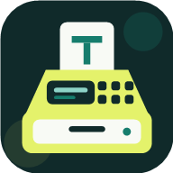

# TapSale

**A cash register for clubs and events – in the browser, and offline.**

Tap products, take the money, hand back the change. Works from a phone, installs like an app
and keeps selling when the network drops – one container, no cloud, no third-party services.

</div>

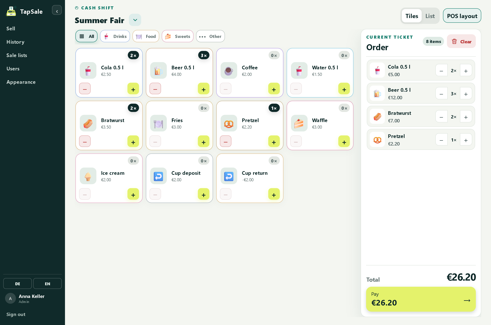

---

## What this is about

Club bars, food stalls and charity events need a till, not a point-of-sale suite. TapSale is
that till: open it on any phone, tap the products, and a big calculator display and a fixed
pay bar do the rest. It installs as a Progressive Web App, so once a device has signed in it
keeps taking sales in flight mode and syncs them the moment the server is reachable again.
The server itself is a single ASP.NET Core container with a SQLite file – nothing else to run.

## At a glance

**Selling**
- **Tile mode** with big two-column product buttons, or a compact **list mode** – the choice
  is remembered per device
- The **total sits on top** as a large calculator display and again in a **fixed pay bar**
  you can reach with one thumb
- A payment sheet with its **own number pad** (no system keyboard), **€5/€10/€20/€50** quick
  keys and change shown large and unmissable
- **Deposit charge and deposit return** as separate, clearly marked item types; a pure return
  may go negative and is closed as a **cash payout**
- Categories shown as **filters, sections or a drill-down**, per sale list

**Offline & PWA**
- Installable to the home screen, full offline start from a **cached app shell**
- Sales are queued in **IndexedDB** with a stable id and a device token, then synced
  **idempotently** – a lost connection never loses or double-books a sale
- Prices are **versioned**, so an offline sale always books the price that was valid when it
  was rung up
- The sync state (**Ready · Pending · Synced**) rides along in the total display
- The **same sale list** can run on several phones at once; their offline sales merge without
  overwriting each other

**Catalog**
- **Sale lists** with their own products and categories, activated or archived
- Products carry a name, end price, type, **icon or uploaded image**, colour and sort order
- **Cash shifts** (optional, system-wide): opening float, counted close, and the cash
  difference worked out for you
- Completed sales are immutable; a mistake is fixed by a linked, auditable **cancellation**

**Users & operations**
- Roles **Admin, Manager and User** with a first-run **setup wizard** for the first admin
- Per-list assignment; a User only sees their own sales, a Manager their assigned lists
- **Device sessions** listed with last activity and last sync, revocable one by one
- **CSV export** by period, list and user, shareable through the **Web Share API**
- German and English, Euro throughout, and a **theme picker** with custom brand colours

## Screenshots

### The selling surface

| Tile mode | List mode |
|---|---|
| 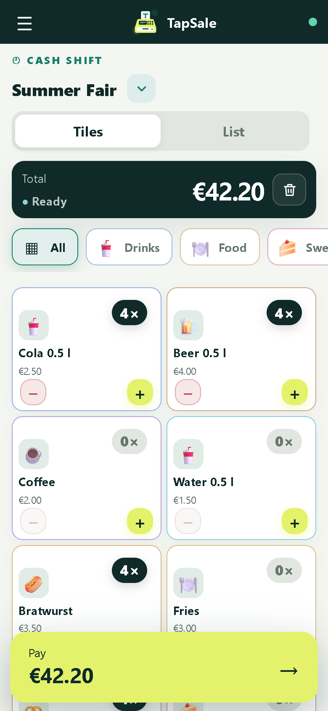 | 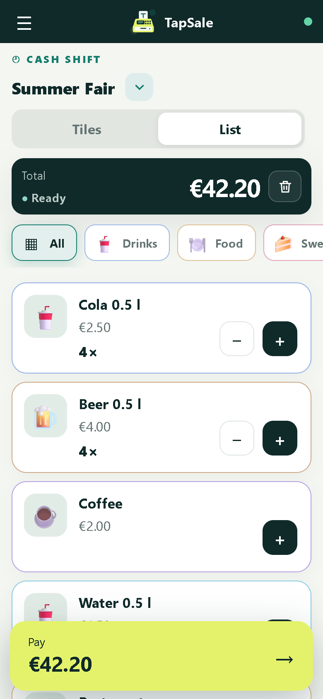 |

Every tap adds to the counter without a moment's delay. The total stays on top, the pay bar
stays on the bottom, and the category chips filter the catalog. Tile or list is a per-device
preference.

### Taking the money

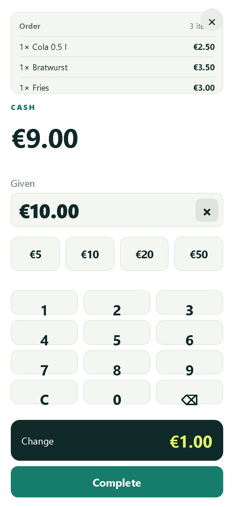

The payment sheet has its own big number pad, quick keys for the common notes and the change
in large type. A negative total (a pure deposit return) turns the sheet into a clearly marked
payout instead.

### History and cash shift

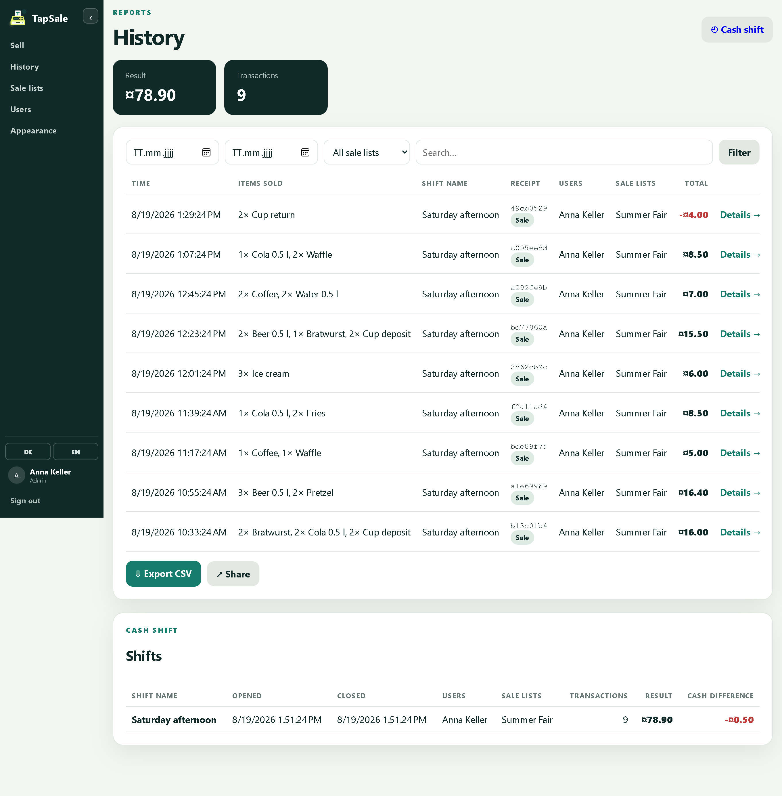

Every sale with its receipt id, items, user and list – filterable by date, list and text, and
exportable as CSV. Optional cash shifts show the opening float, the counted close and the
difference, so the till can be balanced at the end of the day.

### Managing the catalog

| Sale list & products | Product editor |
|---|---|
| 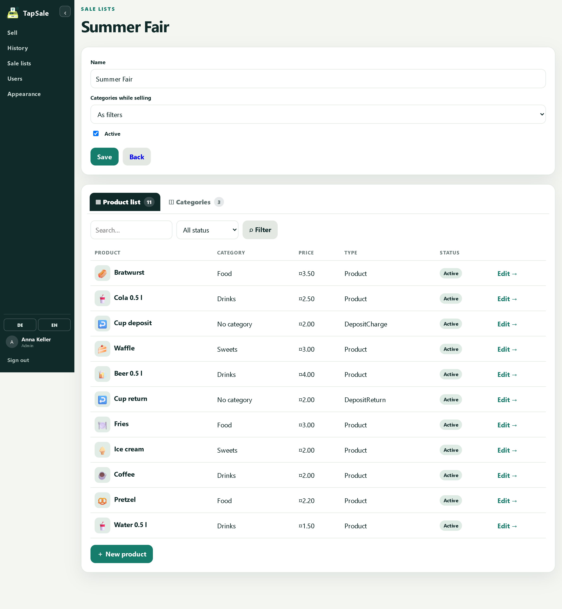 | 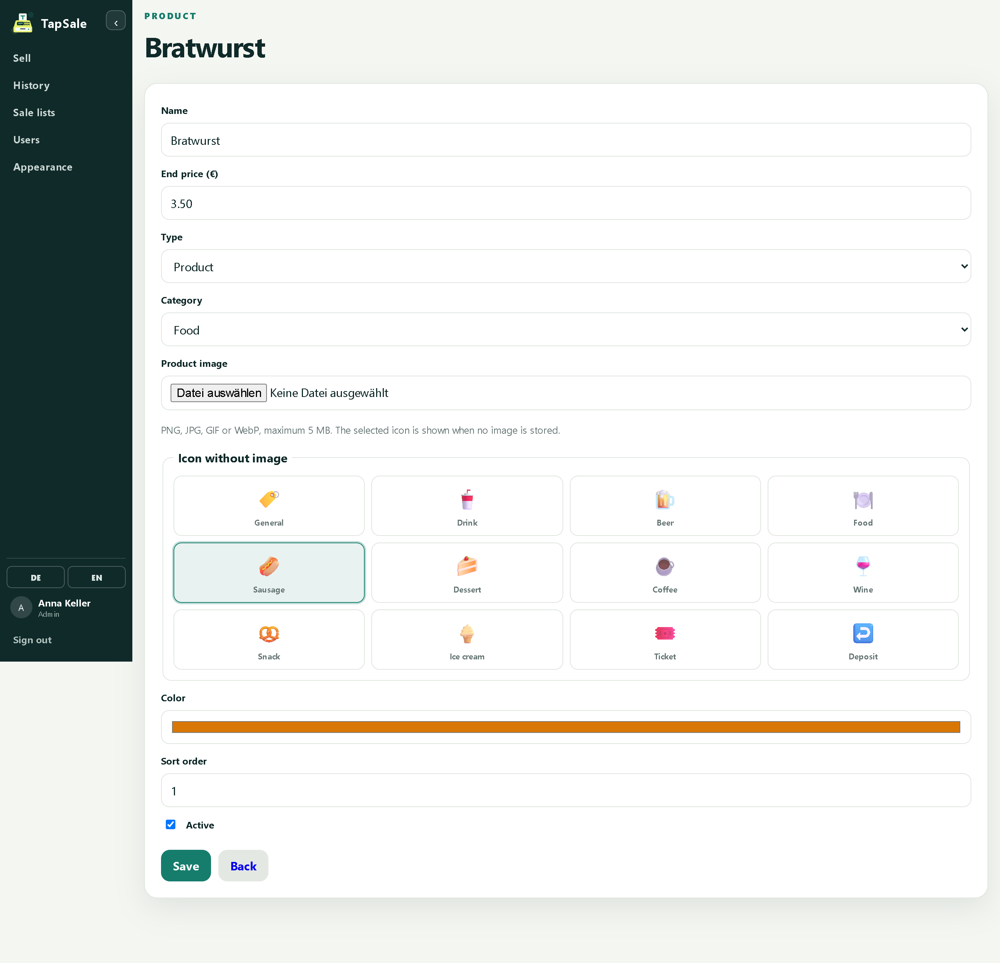 |

A sale list holds its products and categories. Each product gets an icon (or an uploaded
image), a colour and a type – ordinary product, deposit charge or deposit return.

### Users, roles and themes

| Users | Appearance |
|---|---|
| 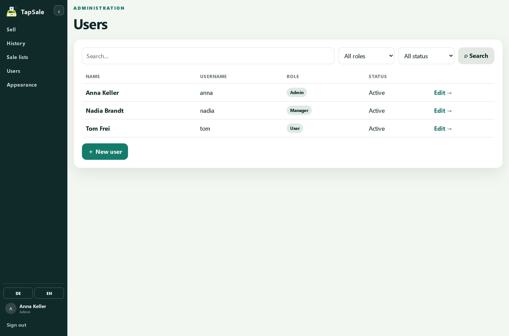 | 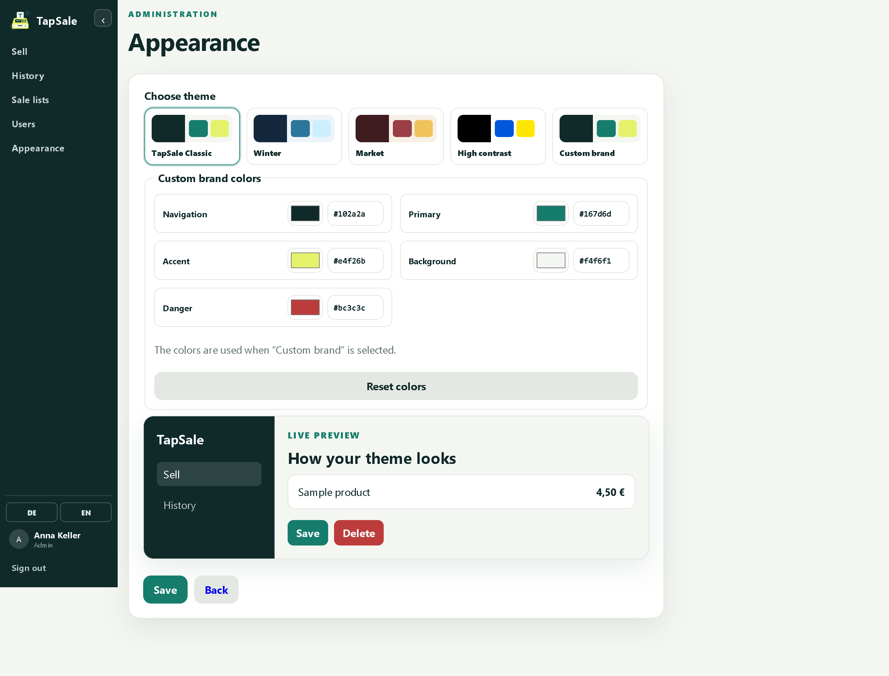 |

Admins manage users, roles and list assignments. The appearance page ships several themes and
a custom brand palette with a live preview – only the sections a role may see are shown.

### On a phone

| Navigation drawer | Sign in |
|---|---|
| 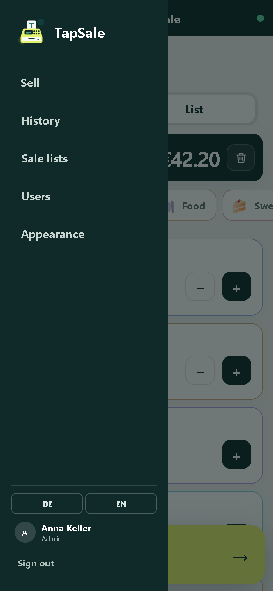 | 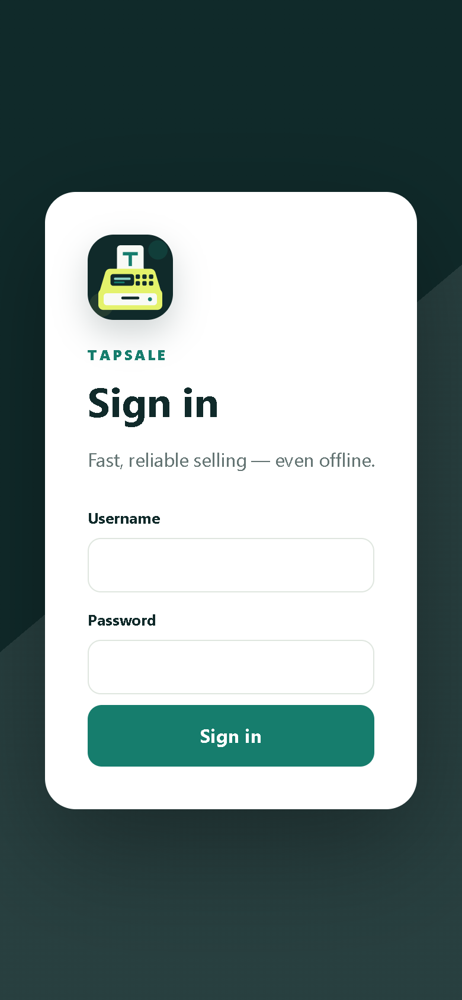 |

On a narrow screen the navigation folds into a drawer. The first sign-in needs the server;
after that the device stays signed in and keeps working offline.

## Quick start

TapSale is built straight from this repository – the image is not published to a registry, so
`docker compose … --build` does the work. Everything lives in the container and one volume.

### 1. Run it

```powershell
$env:TAPSALE_VERSION = "1.0.0-20260819"
docker compose -f compose.release.yml up --build -d --force-recreate
```

Open **http://localhost:9262**. The very first request opens a **one-time setup wizard**:
pick a display name, a username, a password (at least 10 characters) and a language. That
creates the first **Admin** and locks the wizard for good. The `tabsale-data` volume keeps the
database, the uploads and the session keys, so a container restart never signs anyone out.

Without a version the compose file falls back to a `local-…` tag:

```powershell
docker compose -f compose.release.yml up --build -d
```

### 2. Development stack

```powershell
docker compose -f compose.dev.yml up --build -d --force-recreate
```

Same port **9262**, its own `tabsale-dev-data` volume and `ASPNETCORE_ENVIRONMENT=Development`.
Following the project rule, test changes by **rebuilding and redeploying the container**, not
by relying on host live reload. The convenience script calculates the next nightly version and
does the same rebuild/redeploy:

```powershell
./scripts/redeploy-dev.ps1
```

### After the first sign-in

Work through the admin area in this order:

1. **Sale lists** – create a list and add its categories and products (name, end price, type,
   icon or image, colour).
2. **Users** – create the volunteers, give each a role and assign the lists they may use.
3. **Appearance** – pick a theme or set your own brand colours.

Cash shifts are optional and system-wide: a User opens one with the float and closes it with
the counted cash; selling without a shift stays possible. The globe/**DE · EN** buttons at the
bottom of the navigation switch language, and the choice stays with the account.

### Settings that matter

| Variable | Default | Meaning |
|---|---|---|
| `ASPNETCORE_HTTP_PORTS` / `ASPNETCORE_URLS` | `http://+:8080` | Port inside the container (mapped to `9262` on the host) |
| `DataPath` | `/app/data` | Data directory (SQLite, keys, uploads, theme) |
| `ASPNETCORE_ENVIRONMENT` | `Production` | `Development` for the dev stack |
| `TAPSALE_VERSION` | `local-<yyyyMMdd>` | Build arg stamped into the app and the image tag |

The container ships a **health check** (a TCP probe on port 8080) so an orchestrator can wait
for it to come up.

### The `/app/data` volume

```
/app/data
├─ tabsale.db     SQLite database
├─ keys/          DataProtection keys (sessions survive restarts)
├─ uploads/       product images
└─ theme.json     appearance / custom brand colours
```

TapSale does **not** create its own backups. To back up or restore, stop writes and copy the
whole named volume (`tabsale-data`, or `tabsale-dev-data` for the dev stack) – it holds
everything needed to bring an installation back exactly as it was.

## How offline works

The first sign-in needs a reachable server; from then on the device is authorised and keeps
selling with no network at all. Each sale is written to an **IndexedDB queue** with a stable
token and a per-device id, and pushed to `/api/sales/sync` as soon as the connection returns.
Because the sync is **idempotent** and prices are **versioned**, a flaky connection can retry
freely: no sale is lost, none is booked twice, and every line keeps the price it had at the
moment of sale. Session revocations and role changes are picked up on the next server contact.

## Status

| Milestone | Content | Status |
|---|---|---|
| M0 | Foundation: repository, Docker, CI, versioning, data model | ✅ |
| M1 | Offline sell MVP: PWA, tile/list modes, payment sheet, local storage | ✅ |
| M2 | Server & security: SQLite, sync, sign-in, sessions, roles | ✅ |
| M3 | Administration: users, sale lists, products, categories, assignments | ✅ |
| M4 | Reporting: history, cash shift, CSV export, share | ✅ |
| M5 | Production hardening: tests, security, backup docs, release | in progress |

The full plan and open decisions live in [AUFGABENLISTE.md](AUFGABENLISTE.md) (German).

## Development

Building and testing happens through the container:

```powershell
docker compose -f compose.dev.yml up --build -d --force-recreate
docker compose -f compose.dev.yml logs -f
```

The unit tests need no container:

```powershell
dotnet test TapSale.slnx
```

They cover the money-critical pieces: sale and change calculation, the history queries, the
category display modes and product-image storage.

## How it is built

- **ASP.NET Core 10** – classic **Razor Pages** for the managed screens plus a small **minimal
  API** (`/api/sales/sync`, cancellations, cash shifts), **EF Core** on **SQLite**
- The offline selling surface is **plain JavaScript** (a service worker for the app shell,
  IndexedDB for the queue) – no framework, no build step
- Sessions use cookie authentication backed by revocable **`UserSession`** tokens; keys are
  kept via **DataProtection** so restarts don't sign anyone out
- Prices live in **`ProductPriceVersion`** rows, cancellations as linked immutable
  counter-bookings – the audit trail is part of the model, not bolted on

## Branches & versioning

| Branch | Purpose | Version |
|---|---|---|
| `main` | Release | `<major>.<minor>.<build>-<yyyyMMdd>` |
| `dev` | Development | `nightly-<build>-<yyyyMMdd>` |
| local | – | `local-<yyyyMMdd>` |

The build number comes from the GitHub run number; the CI workflow builds a versioned release
image (`tapsale:<version>`) on every push to `dev` and `main`. Commits use the locally
configured author identity.
